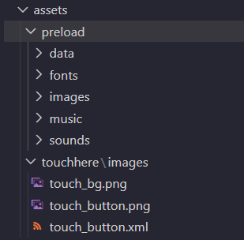
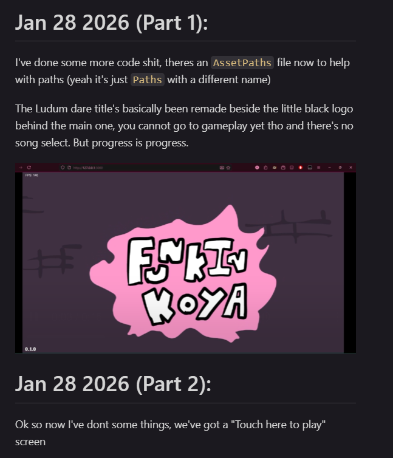
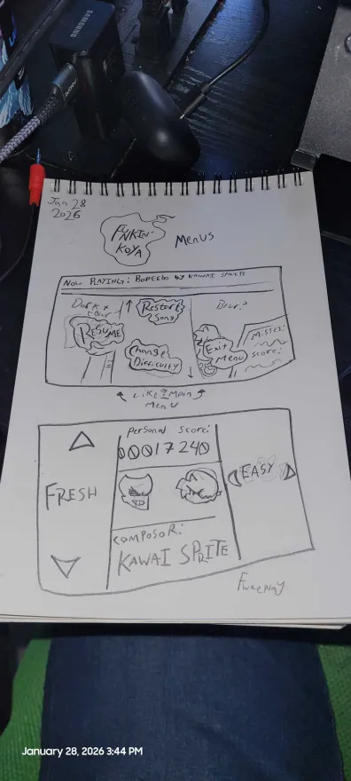

# Jan 28 2026 (Part 1):

I've done some more code shit, theres an `AssetPaths` file now to help with paths (yeah it's just `Paths` with a different name)

The Ludum dare title's basically been remade beside the little black logo behind the main one, you cannot go to gameplay yet tho and there's no song select. But progress is progress.

<video controls src="./2026/1-28/20260128-1336-22.0375781.mp4" title="ludum dare title"></video>

Split becuz of school btw :/

# Jan 28 2026 (Part 2):

Ok so now I've done some things, we've got a "Touch here to play" screen, the code's been organized more into backend and frontend folders, I've got libraries changed to just be folders in assets that have data, images, music, sound folders and prob more later down the line.

Oh and the blogs (devlogs?) are gonna be stored on the github now and will be linked in the readme :D

At school I got some concepts down for the mod, plans, and some ideas, but one of the important ones I wanna show you is the pause menu and freeplay menu.

The pause menu was gonna be like the buttons scrolling around but it got changed midway through the drawing to be like the FNF Main Menu cause that works better and then it'll show song info, your play's info, I contemplated removing the score text and putting that in the pause menu but I don't know...

Freeplay was gonna be like that but I wanted to be unique, so on the left its the songs, the right the difficulty (and later variation!) and in the center your high score, the song composer, and the player and opponent icons.

Things are cookin.

# Jan 28 2026 (Part 3):

Now they're split even more cause they're digital and while working I don't want to constantly be updating past shit.

Anyway, songs have their own library folder and charts and music go there.

Funny bug I found was that GF is cheering every beat of the song in tutorial lol, I know why So Imma go fix it but it was funny so I wanted to mention it, video didn't wanna fucking work tho so I have no video evidence :(

# Jan 28 2026 (Part 4):

On the title I added the logo shadow
<video controls src="./2026/1-28/20260128-2350-42.1932846.mp4" title="ludum dare title with shadow"></video>
