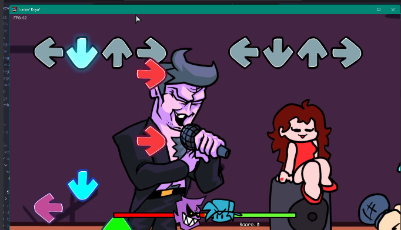

# Jan 29 2026

## Part 1:

Today is an art day, Imma start crankin out sprites today.
Got good progress on BF.

<video controls src="./2026/1-29/20260129-1340-26.0237826.mp4" title="bf fnf"></video>

## Part 2:

Finished BF!
There's now a Characters library folder for organization too

<video controls src="./2026/1-29/20260129-2139-24.4981217.mp4" title="bf"></video>

## Part 3:

Technically finished GF.
<video controls src="./2026/1-29/20260129-2216-36.2999598.mp4" title="gf"></video>

She's got her most important animation, the bopping.
But she's missing the speaker.

I think I'll have that be like a stage prop. A good reference to where I should place her too, yknow?

And also the sprite sheets smaller so yeah.

Oh wait but fuck the hair has to be behind it...

Texture atlases?
Texture atlases.

## Part 4:

Okay so here's a cool plan I got.

Characters can have their own class (to cleanup the Character haxe file lol) and then there's a class PlayState uses to get the correct Character class, if it exists.

Basically I'm splitting up characters into their own character classes.

## Part 5:

Okay okay, good progress. Very good progress.
I should probably do this thing called eatting.

<video controls src="./2026/1-29/Screen Recording 2026-01-29 183703.mp4" title="gameplay"></video>
<video controls src="./2026/1-29/20260130-0039-19.4441350.mp4" title="gameover"></video>

I'll do stage stuff next, maybe after giving gf sing anims...?

## Part 6:

Okay, stage stuff and gf singing anims done, time to do stage coding stuffs :D

## Part 7:

A LOT OF STAGE CODING STUFFS LATER!

