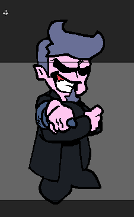

# Jan 29 2026

## Part 1:

Mr Daddy Dearest is here and I accidentally fucking drew him with the wrong brush size.
Whatev :D

And now in freeplay the arrows are lookin juicy.

<video controls src="./2026/1-30/Screen Recording 2026-01-30 070023.mp4" title="Title"></video>

## Part 2:

Freeplay Difficulty Select :DDDDDDDDDDD

## Part 3:

Okay alot more now :D

I've done the following:
- Freeplay Score Text
- Song Composer(s) Field (4 freeplay and pause)
- Added checks for a missing txt file in CoolUtil in coolTextFile
- Made a song class
- Added CHARTING define (will send u to charting start on start)
- Made ChartSwagSong typedef for saving chart files
- Added Crash preventions to the Song class (try catches n shit lol)
- Test is now stored in Song (the class)
- FunkinSprite correctAnimationName "Sprite tried to play animation "$name" that does not exist! This is bad!" now returns the name cause it made the flxg log msg say there isnt a null animation
- Pause menu has top text stuff now :D
- BOTPLAY define (doesnt really enable botplay tho lol it just makes ur shit perfect when u hit)
- Fixed song score saving
- Fixed loading song inst and vocals in chart editor

And yah :D
