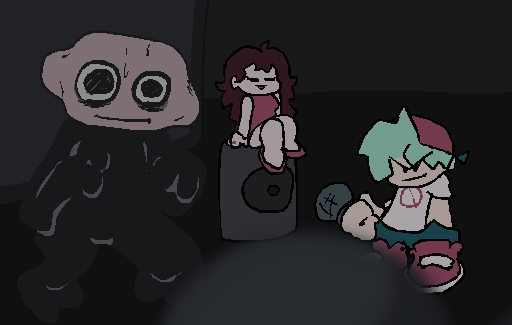

# Feb 1 2026

## "One day man"
<!-- -# The power of a no life... -->

Holy shit. Lemme tell you. This was a BIG THING. And about 72% of it was done in ONE DAY?
What da faq?????????????

The major things.

- Week 2 Koya
- Event Notes
- Main Menu
- Story Mode Menu

The main events.
Besides Event Notes. Those were just an additional thing cause why not.

## Week 2

Week 2, doing the soooky kids was annoying as fuck, not even like a drawing issue its just cause they're 2 characters in one, doubling the shit I had to do. So ofc they took (probably) the most time.

The stage was pretty easy, only real issue was it was too big cause I drew it on a 1920 x 1080 canvas and it went beyond that and haxeflixel has a limit for sprite sizes, which was annoying but it was fine, I just made a symbol that scaled it down and then scaled it up in-game.

Monster. Monster. I wanted, and still do want him to be a unique thing to this mod.
Internally I keep calling him "Retsnom". Just to give him a unique identity for this mod specifically.

If you weren't aware, in this mod all the weeks are indeed in story order, and I want Retsom, Monster. To be important in the story, I don't know he just seems like something I could have fun with. Especally if I can nab a composer to make custom songs cause mine are ass. Especally with lyrics? Heeeeeeeeelllllllllllllllllllll nah.

But yeah, I made him be a lil unique. In his song, it's the first to use a shader. For the course of the song there is an adjust color shader applied.

(In the flash file it has the scaled down symbol there instead of the regular sized one, just a heads up)

The shader is supposed to make it more creepy, yknow? But originally I wanted to use it so bf, gf, and the stage look similar to how I drew monster with the desaturated colors.

The way I drew monster is unique cause normally I take the colors used by base game, but this time I made my own colors, desaturated colors, I mainly wanted to use the desaturated colors for the backgrounds, contrast, the characters, notes, general hud is bright colors and the background is desaturated colors, you shouldn't focus on the BG.

But with Monster he's desaturated, but he's important.

## Main Menu

The main menu was a nice little thing to do, make some assets for it and then make the functionality,
but the real thing comes from when I wanted the story mode menu to extend it and modify the main menu logic.

So what I did is add support for "Horizontal" menu types and expanded it, the menu items support different prefix paths, there are some variables to help change things and make it easier.

And boom :D

## Story Mode Menu

I just needed some more graphics for the weeks, the new up and down difficulty sprites, and then I coded in shit and all was niceeee.

## All in a days work

That was a very pleasent day, I got alot done.
I've just got 2 things left to do, maybe an extra one too.

Halloween versions for BF and GF, and maybe a "Hey!" animation for BF regular for week 1.
